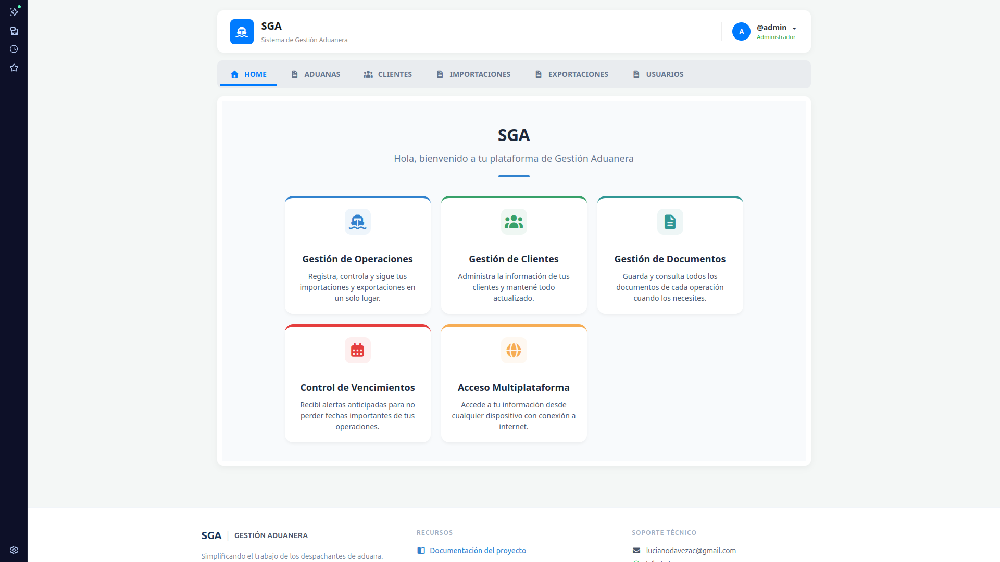
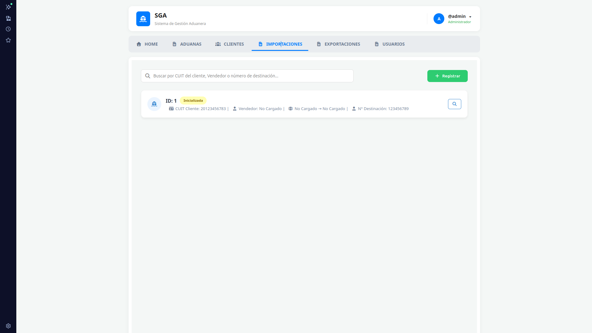
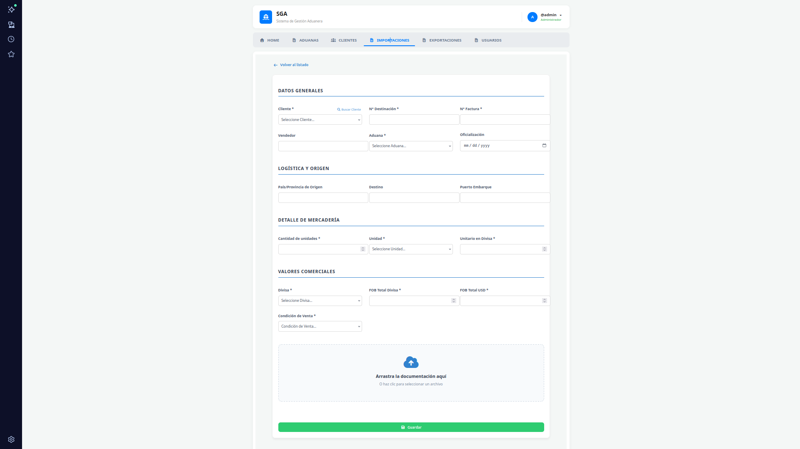
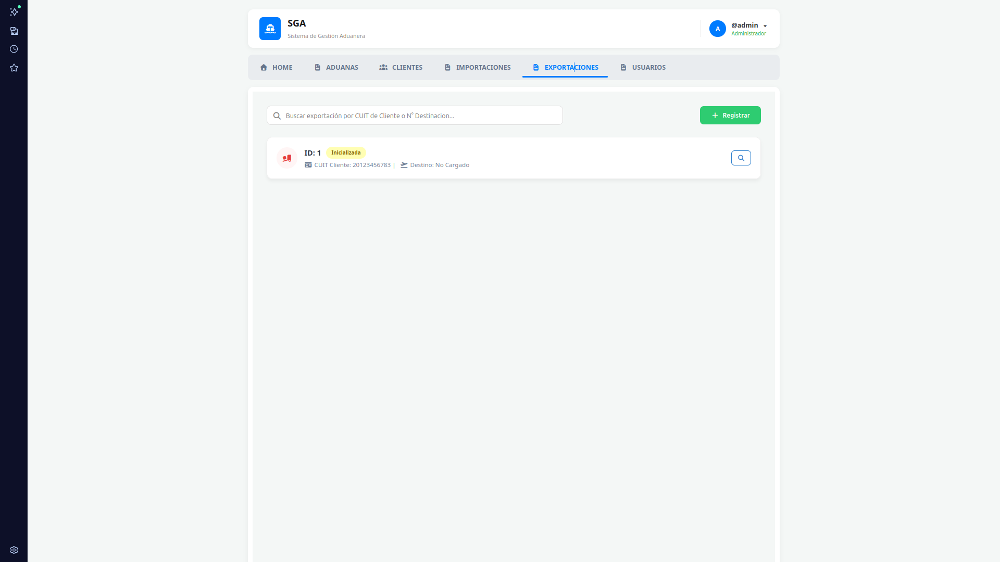
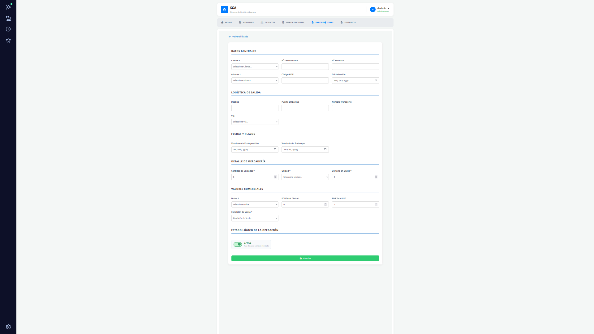
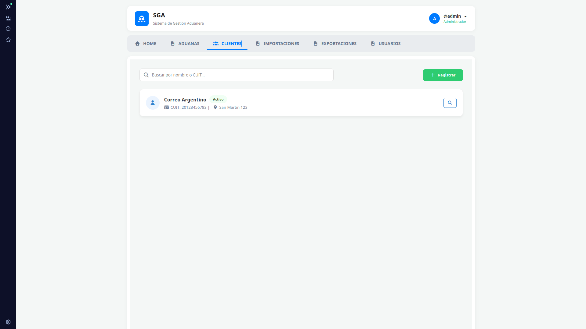
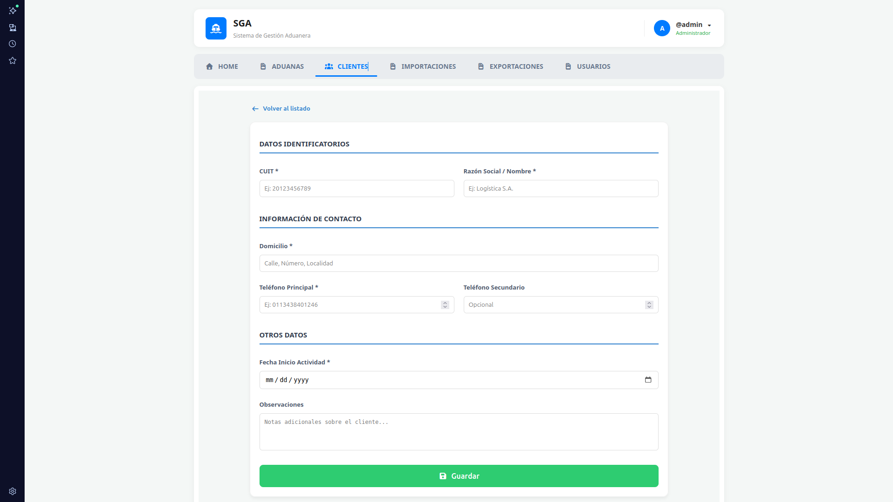
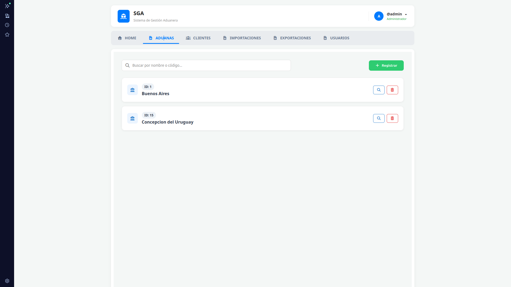
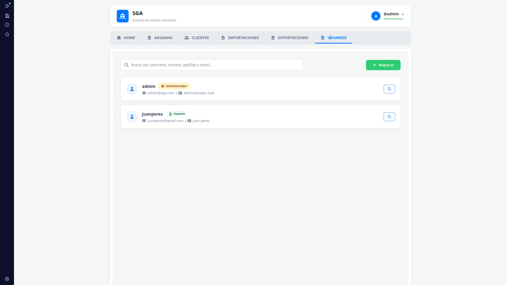

# SGA — Sistema de Gestión de Operaciones Aduaneras


Sistema web desarrollado como proyecto final de carrera en la **Universidad Tecnológica Nacional — Facultad Regional Concepción del Uruguay**, para la gestión de operaciones de importación y exportación aduanera.

> Habilitación Profesional — Ingeniería en Sistemas de Información — UTN FRCU — 2024

---

## 📋 Descripción

SGA reemplaza el flujo manual (Google Sheets + Google Drive) de una empresa de comercio exterior con ~100 operaciones mensuales y 74+ clientes. Centraliza la gestión de importaciones, exportaciones, clientes y aduanas, con control de vencimientos y alertas automáticas por correo.

### Funcionalidades principales

- Registro y seguimiento de operaciones de **importación y exportación**
- Gestión de **clientes** con adjuntos de documentación
- Control de **vencimientos** con alertas visuales y notificaciones por email
- **Roles de usuario**: Administrador y Usuario estándar
- Autenticación segura con **JWT + CAPTCHA**
- Adjuntar y descargar archivos por operación

---

## 🏗️ Arquitectura

```
┌─────────────────────┐        HTTP/JSON        ┌──────────────────────┐
│   Frontend — React  │ ──────────────────────► │  Backend — Django    │
│   Vite + Axios      │ ◄────────────────────── │  REST Framework      │
│   Puerto 5173       │        JWT Auth          │  Puerto 8000         │
└─────────────────────┘                          └──────────┬───────────┘
                                                            │
                                                    ┌───────▼───────┐
                                                    │   SQLite 3    │
                                                    │  (desarrollo) │
                                                    └───────────────┘
```

---

## 🚀 Inicio rápido (Docker)

### Requisitos previos

- [Docker Desktop](https://www.docker.com/products/docker-desktop/) instalado y en ejecución

### Pasos

**1. Clonar el repositorio**

```bash
git clone https://github.com/tu-usuario/Sistema-Gestion-Aduanera-SGA.git
cd Sistema-Gestion-Aduanera-SGA
```

**2. Configurar variables de entorno**

```bash
cp .env.example .env
```

Editar `.env` con los valores reales:

```env
# Backend
SECRET_KEY=tu_clave_secreta_django
DEBUG=True
ALLOWED_HOSTS=localhost,127.0.0.1
EMAIL_HOST_USER=tu_correo@gmail.com
EMAIL_HOST_PASSWORD=tu_contraseña_de_aplicacion

# Frontend
VITE_API_URL=http://localhost:8000
```

> Para `EMAIL_HOST_PASSWORD` usar una [contraseña de aplicación de Gmail](https://support.google.com/accounts/answer/185833), no la contraseña personal. Sin esta configuración el sistema funciona normalmente pero no envía alertas por correo.

**3. Construir e iniciar los contenedores**

```bash
docker-compose up --build
```

**4. Aplicar migraciones**

```bash
docker exec -it sga_backend python manage.py migrate
```

**5. Acceder a la aplicación**

| | |
|---|---|
| URL | http://localhost:5173 |
| Usuario | `admin` |
| Contraseña | `123456789` |

> ⚠️ Cambiá la contraseña del usuario `admin` inmediatamente después del primer inicio de sesión.
 
---
 
## 🖼️ Capturas
 
### Panel Principal
 

 
### Importaciones
 

 

 
### Exportaciones
 

 

 
### Clientes
 

 

 
### Aduanas
 

 
### Usuarios
 

 
---
 


## 🗂️ Estructura del proyecto

```
Sistema-Gestion-Aduanera-SGA/
├── Backend/
│   ├── apps/
│   │   └── SGA/
│   │       ├── models.py
│   │       ├── serializers.py
│   │       ├── views.py
│   │       └── urls.py
│   ├── core/
│   │   └── settings.py
│   ├── manage.py
│   ├── requirements.txt
│   └── Dockerfile
├── Frontend/
│   ├── src/
│   │   ├── api/         # Axios + JWT interceptor
│   │   ├── components/  # Componentes de gestión
│   │   ├── pages/       # Login, Home/Dashboard
│   │   └── utils/       # Validaciones CUIT y fechas
│   ├── package.json
│   └── Dockerfile
├── .env.example
├── docker-compose.yml
└── README.md
```

---

## ⚙️ Instalación manual

<details>
<summary>Ver instrucciones sin Docker</summary>

### Backend

```bash
cd Backend/
python -m venv venv
source venv/bin/activate      # Linux/Mac
venv\Scripts\activate         # Windows

pip install -r requirements.txt
cp .env.example .env          # completar con valores reales

python manage.py migrate
python manage.py createsuperuser
python manage.py runserver
```

### Frontend

```bash
cd Frontend/
npm install
cp .env.example .env         
npm run dev
```

</details>

---

## 🔐 Roles y permisos

| Funcionalidad | Administrador | Usuario estándar |
|---------------|:---:|:---:|
| Ver importaciones/exportaciones | ✅ | ✅ |
| Registrar/modificar operaciones | ✅ | ✅ |
| Gestión de clientes | ✅ | ✅ |
| Gestión de aduanas | ✅ | ❌ |
| Gestión de usuarios | ✅ | ❌ |
| Alertas de vencimiento | ✅ | ✅ |

---

## 🛠️ Stack tecnológico

| Capa | Tecnología |
|------|-----------|
| Frontend | React 19 + Vite 7 |
| Backend | Django 4 + Django REST Framework |
| Autenticación | SimpleJWT + django-simple-captcha |
| Base de datos (dev) | SQLite 3 |
| Base de datos (prod) | MySQL 8+ |
| Animaciones | Framer Motion |
| Contenedores | Docker + Docker Compose |
| Correo | SMTP Gmail |

---

## 👥 Autor

**Luciano Emmanuel Davezac**

**Profesores:** Ing. Miriam Kloster — Ing. Adrian Callejas

**Institución:** Universidad Tecnológica Nacional — Facultad Regional Concepción del Uruguay  
**Carrera:** Ingeniería en Sistemas de Información — Habilitación Profesional  
**Año:** 2024

---

